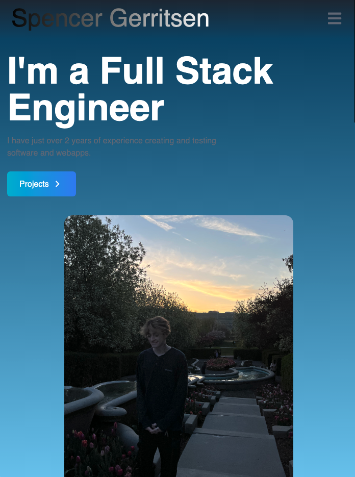

# Minka - Developers notes and questions forum
  
  ## Table of Contents
  * [Description](#description)
  * [Installation](#installation)
  * [Usage](#usage)
  * [Licenses](#licenses)
  * [Questions](#questions)
  * [Credits](#credits)

  ## Description 
  This is my Portfolio made with React.js
  
  
  
  
  Here is the mobile hamburger option
  
## Installation 
 git clone code or download repo as a zip
## Usage 
"npm i/npm install"
## Licenses 
  ## Licenses
    This project is covered under the MIT license. To learn more about what this means, click the license button at the top.
## Questions 
Any questions about the project?
Github: https://github.com/sppencerr
Email: spencergerritsen@gmail.com
## Credits 
Minka

